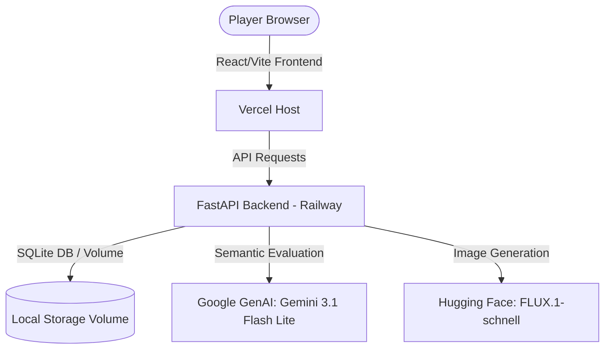

# Prompt Guesser
### *The Daily Wordle-Style AI Reverse-Engineering Game*

> **PRISM Codex Creative Ideas Hackathon Submission**  
> **Author:** Pratham Shah  
> **Live Demo:** [prompt-guesser-2jvb51c6z-pratham1019.vercel.app](https://prompt-guesser-2jvb51c6z-pratham1019.vercel.app/)

[](#)
[](#)
[](#)
[](#)

Can you reverse-engineer the prompt that generated today's AI image? 

**Prompt Guesser** is a sleek, premium, daily reverse-prompting game. Every 24 hours, a new AI-generated masterpiece is published. Players have **5 attempts** to guess the core concepts behind the image. Instead of matching words literally, a custom **Gemini AI Semantic Judge** evaluates the conceptual understanding of your guess, providing dynamic feedback and score ratings from 0% to 100%!

---

## Gameplay & Core Features

*   **The Daily Challenge:** One image. Resetting globally at **12:00 AM IST (Asia/Kolkata)**.
*   **Semantic Scoring (Not Literal Word-Matching):** Enter your guess, and our Gemini Judge evaluates it across key dimensions (Subject, Actions, Location, Setting). Synonyms are aggressively rewarded!
*   **Zero Frustration Perfect-Score Normalization:** If you guess all major concepts correct (97%+ similarity), the system automatically rounds your score to **100%**, letting you win without having to guess obscure prompt adjectives.
*   **Dynamic Hints:** Receive helpful guidance detailing what elements you matched and what general categories are still missing (e.g., *"Focus on the location"*), strictly keeping it spoiler-free.
*   **Shareable Emoji Grid:** Post your victory grids to social media, Wordle-style!

```text
Prompt Guesser [2026-07-06]
Best Score: 100%
Attempts: 3/5
Grid: 🟧 🟨 🟩
Play at: https://prompt-guesser-2jvb51c6z-pratham1019.vercel.app/
```

---

## Technology Stack

Prompt Guesser is built with a modern, high-performance, decoupled architecture:



### Frontend (`/frontend`)
*   **Core:** React 18, TypeScript, Vite.
*   **Styling:** Custom Neo-Brutalist CSS UI design system. High-impact color palettes, card elevations, and custom responsive layouts built to fit all mobile and desktop screens perfectly.
*   **State:** LocalStorage-based persistent gameplay history, settings, and session caching.

### Backend (`/backend`)
*   **Core:** FastAPI (Python 3.13) with SQLAlchemy (asyncio) and SQLite database on a persistent mounted Railway volume.
*   **Migrations:** Alembic.
*   **Self-Healing AI Fallback Pipeline:** A prioritized model-level fallback sequence (`gemini-3.1-flash-lite` ➔ `gemini-2.5-flash-lite` ➔ `gemini-2.5-flash` ➔ `gemini-1.5-flash`) ensures that the judge API remains 100% operational even during quota limits or regional cloud outages.
*   **Automated Cron Orchestration:** Exposed as a hidden HTTP endpoint (`POST /internal/cron/daily`) protected by `CRON_SECRET` headers and atomic execution locks. Fully compatible with Railway Cron trigger containers, GitHub Actions, and external ping services.

---

## Built Pair-Programmed with Codex

This repository was designed, structured, refactored, and deployed through pair-programming between the developer and **Codex**, which drove the core logic generation, component engineering, backend architectures, testing pipelines, and deployment validation.

Key automated milestones accomplished by the AI agent:
1.  **Neo-Brutalist Styling Refactor:** Reshaped the landing page and settings overlays to build a stunning, premium mobile-first interface.
2.  **Semantic Judge Upgrades:** Configured the scoring prompt guidelines and built the programmatic Python normalization algorithms.
3.  **Self-Healing Fallbacks:** Created the GenAI client retry chain to safeguard uptime.
4.  **Database & Migration Strategy:** Standardized Supabase PostgreSQL schema and automated migrations via Alembic.

---

## Navigation & Project Links

Explore the different layers of the project:

*   **[Frontend App](./frontend):** React code, icons, UI components, and API routing bindings.
*   **[Backend Engine](./backend):** FastAPI routes, database models, Alembic migrations, AI prompt definitions, and testing files.
*   **[Design Specifications](./DESIGN.md):** Deep-dive into Neo-Brutalist style systems, colors, typography, UI wireframes, and design philosophy.
*   **[Product Strategy](./PRODUCT.md):** Target audience analysis, Wordle marketing strategy, feature roadmaps, and project goals.

---

## Quick Start (Local Development)

### 1. Run the Backend
```bash
cd backend
# Create environment file
cp .env.example .env
# Install dependencies & run backend server
uv run uvicorn main:app --reload --port 8000
```

### 2. Run the Frontend
```bash
cd frontend
# Install dependencies & run development server
npm install
npm run dev
```
Open `http://localhost:5173` in your browser and start guessing!
